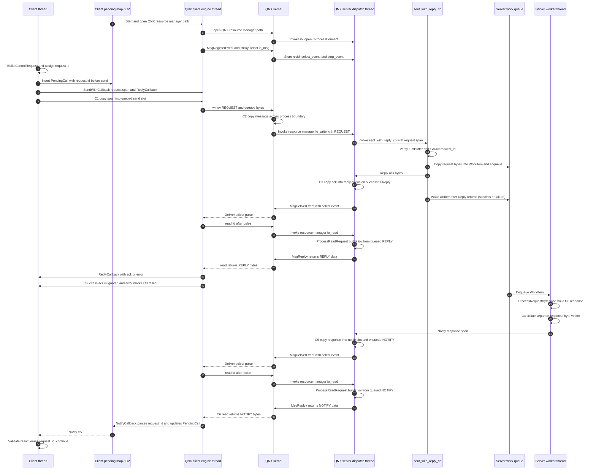
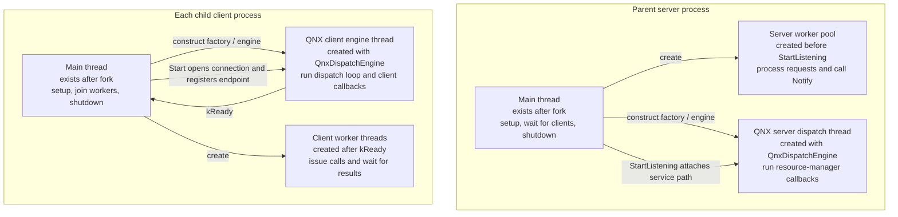
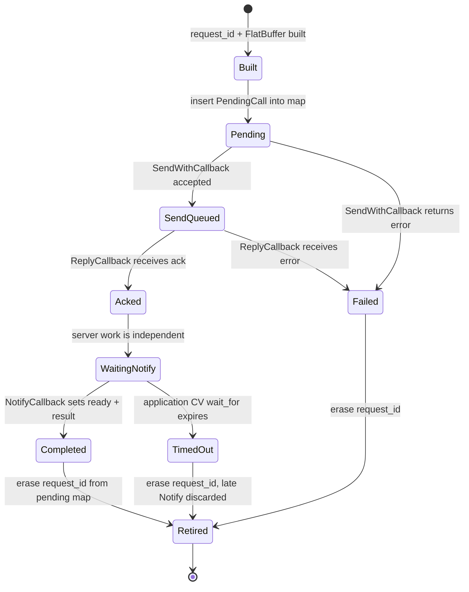
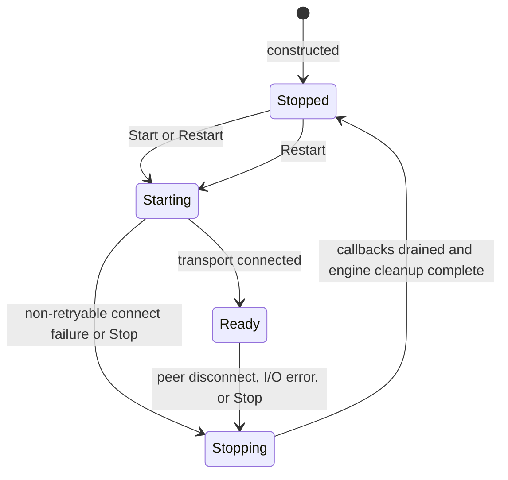

<!-- ----------------------------------------------------------------------------
  Copyright (c) 2026 Contributors to the Eclipse Foundation

  See the NOTICE file(s) distributed with this work for additional
  information regarding copyright ownership.

  This program and the accompanying materials are made available under the
  terms of the Apache License Version 2.0 which is available at
  https://www.apache.org/licenses/LICENSE-2.0

  SPDX-License-Identifier: Apache-2.0
----------------------------------------------------------------------------- -->

# score::message_passing POC and QNX Usage Overview

## Scope

This document describes the low-level POC in [poc_low_level.cpp](poc_low_level.cpp) and the `score::message_passing` implementation selected by the platform build. The dependency is `score_communication` version `0.3.0`, as declared in [MODULE.bazel](../../../MODULE.bazel).

The public API is platform-independent. `client_factory.h` selects `QnxDispatchClientFactory` and `QnxDispatchEngine` when `__QNX__` is defined; otherwise it selects `UnixDomainClientFactory` and `UnixDomainEngine`.

## Executive Summary

| Concern | Linux | QNX |
|---|---|---|
| Transport | Unix-domain `SOCK_STREAM` socket | QNX resource-manager path and message-passing events |
| Client engine | One `UnixDomainEngine` background thread per engine | One `QnxDispatchEngine` dispatch thread per engine |
| Server engine | One engine thread polls the listening socket and client sockets | One dispatch thread runs `dispatch_block()` / `dispatch_handler()` |
| Application workers | POC-owned server worker pool performs the request | Same POC-owned worker pool performs the request |
| Client send path | `SendWithCallback()` copies into a queued send slot, then engine calls `sendmsg()` | `SendWithCallback()` copies into a queued send slot, then engine calls `writev()` |
| Server receive path | Engine receives into a shared receive buffer, then invokes the handler span | Resource-manager `io_write` supplies a span, then the handler is invoked |
| `Reply()` | `sendmsg(REPLY)` from the calling thread; it can block in the socket layer | Copies into `reply_message_`, queues it, and signals the client with `MsgDeliverEvent`; the payload is returned later through `io_read` / `MsgReplyv` |
| `Notify()` | `sendmsg(NOTIFY)` from the worker thread; it can block in the socket layer | Copies into a preallocated notify slot and signals the client with `MsgDeliverEvent`; the payload is returned later through `io_read` / `MsgReplyv`; returns `ENOBUFS` when the per-connection pool is full |
| Peer disconnect | EOF or `EPIPE` transitions the client to `kStopping` | QNX connection-death pulse or read failure transitions the client to `kStopping` |

The POC deliberately uses two phases because the library serializes `REQUEST` messages on one connection until the server calls `Reply()`:

1. `SendWithCallback()` sends a request and receives a small acknowledgement through `Reply()`.
2. The server performs the work independently and sends the full result with `Notify()`.

The acknowledgement is a protocol release, not the operation result.

## Diagram 1: POC QNX Deployment and Call Flow

The process layout is created by `fork()`: the parent is the server and each child is a client. IPC objects are created after the fork. Each client process has one shared connection for all of its client threads.

### QNX copy and lifetime rules

- The span passed to `SendWithCallback()`, `Reply()`, or `Notify()` is a borrowed view. The caller owns the source bytes.
- `ClientConnection::TryQueueMessage()` copies a client request into a library-owned `SendCommand.message`. With `truly_async=true`, this copy is required before the caller can return safely.
- `ServerConnection::Reply()` copies the acknowledgement into the library-owned `reply_message_` before it is placed on the server send queue.
- `ServerConnection::Notify()` copies the response into one of the preallocated `notify_storage_` slots. The slot is returned to `notify_pool_` only after the queued message has been delivered.
- The QNX resource manager and kernel perform the process-boundary transport. The callback receives a span valid for the callback invocation; it must not retain that span.
- The POC performs another application copy when it stores the received request in `WorkItem::request_bytes`. This is necessary because the worker runs after `sent_with_reply_cb` returns.
- The POC's worker creates a separate response vector. It is then copied again by `Notify()` into the QNX notify pool.
- `max_queued_notifies >= T` is required for the POC's maximum number of concurrent calls per client connection. If the pool is exhausted, `Notify()` returns `ENOBUFS`; the client eventually reaches its application timeout.

### QNX threading view

### QNX delivery and failure semantics

- Before any response can be delivered, the client engine registers `select_event_` and `ping_event_` with `MsgRegisterEvent()` and sends a sticky-select `io_msg`. The server stores the resulting `rcvid_` and event descriptions on the `ServerConnection`.
- `Reply()` and `Notify()` are queue operations on the server connection. `MsgDeliverEvent()` delivers a pulse that wakes the client engine; it does not carry the response payload.
- After the pulse, the client calls `read(fd)`. The QNX resource manager invokes `io_read`, which calls `ProcessReadRequest`; that method uses `MsgReplyv()` to return the queued protocol code and bytes to the client read.
- `Notify()` can fail with `EMSGSIZE` for an oversized response or `ENOBUFS` when the per-connection notify pool is exhausted. A successful return means the response was accepted into the server queue, not that the client callback has completed.
- The implementation ignores the return values of `MsgDeliverEvent()` and `MsgReplyv()`. Pulse delivery, client read, or queued-read completion can therefore fail after `Reply()` or `Notify()` has returned successfully; the client may then stop or time out.
- A valid `REQUEST` must receive `Reply()` promptly. Until the reply callback runs, the client does not release the per-connection request serialization and cannot send the next queued request on that connection.

## Request and Connection State Models

### POC request state

`Acked` is a logical POC state. The POC does not store an explicit acknowledgement flag because a successful ack is not the result; it keeps waiting for `Notify()`. A failed acknowledgement sets `PendingCall::ready` and wakes the caller as a failure.

### Library connection state

### Server-side request lifecycle

```mermaid
stateDiagram
    [*] --> Received: io_write receives REQUEST
    Received --> Validated: verify FlatBuffer + request_id
    Validated --> WorkQueued: copy request into WorkItem
    WorkQueued --> AckQueued: Reply ack
    AckQueued --> Processing: wake worker
    WorkQueued --> AckFailed: Reply fails; wake worker
    AckFailed --> Processing: worker may still execute admitted work
    Processing --> NotifyQueued: Notify response
    NotifyQueued --> Delivered: pulse, read, and MsgReplyv complete
    NotifyQueued --> Dropped: EMSGSIZE, ENOBUFS, disconnect, or delivery failure
    Validated --> Rejected: invalid request
    Delivered --> [*]
    Dropped --> [*]
    Rejected --> [*]

```

## Linux versus QNX: What the POC Can Assume

The application-level flow and state model are the same on both platforms. The important portability boundaries are:

1. **The asynchronous send guarantee is configuration-dependent.** The POC sets `truly_async=true` and sizes `max_queued_sends` and `max_async_replies` to `T`, so client call threads only enqueue into library-owned storage.
2. **The server worker lifetime guard is required on both platforms.** A worker stores a raw `IServerConnection*`; the POC pairs it with a per-connection `shared_ptr<bool>` and holds the live-connection mutex across the check and `Notify()` call.
3. **The QNX resource limits are real queue limits.** `max_queued_notifies` is used by QNX. The corresponding `ServerConfig` fields are ignored by the Linux Unix-domain implementation, which relies on socket buffers and the kernel's stream transport instead.
4. **`Notify()` is not equally bounded.** The QNX implementation can fail quickly with `ENOBUFS`, while the Linux implementation calls `sendmsg()` from the worker and may block in the socket layer. The POC comments explicitly call out this difference; the application timeout bounds the client wait, not necessarily the duration of a server-side `Notify()` call.
5. **The public connection state is richer than the POC's ready/stopped handling.** The library exposes `kStarting`, `kReady`, `kStopping`, and `kStopped`; the POC waits for `kReady` and observes `kStopped`, while the intermediate transitions remain library-internal to the POC.

## To be considered for proper impl:

- POC focuses mainly on the good path. Basic errors checks are implemented, but they are not yet sufficient or thorough enough.
- Define the config parameter values (number of threads, ... , size of transferred elements)
  - Enforce configuration consistently: number of clients (`N`), concurrent requests per client (`T`), maximum payload (`M`), worker count, transport queue depths, application work-queue depth
- Make timeout mandatory and passed by called -> Interface change?
- Make SerDe lib exchangable
- Think about connection policy e.g. one connection per UID or N per UID. Ideally switchable
    - Or bring out the admission call to allow custom behaviour
- Use proper state machines for connection state, pending request state and work item state
- Use base-libs thread pools
- Job cancellation is not implemented.
  - Define cancellation and shutdown behavior for queued and in-flight work, client disconnects, server termination, and worker teardown.
  - Define typed timeout, connection-loss, cancellation, and delivery errors, including cleanup of pending request state and handling of late notifications.
  - We propably need a stop / cancel token in the workitems, however if we can actually cancel a running request depends on actual processors of the requests
  - Need to also think how to properly give preference to "cancel requests" and if they need to be handled differently than normal ones
- Bound the application work queue and define admission behavior when it is full. A request must not be acknowledged unless admission and the associated resource reservation have succeeded.
- Define authenticated peer identity, endpoint permissions, authorization, and behavior for rejected or reconnecting clients.
- If acknowledgement delivery fails after queue admission, either cancel the queued work or expose the resulting "may have executed" outcome and define retry rules, especially for non-idempotent operations.
